# Crypto Trading Platform Demo (Expo + React Native + TypeScript)

A mobile demo inspired by **Crypto Trading Platform** workflows for institutional crypto users.  
Includes **Custody**, **Trade**, **Lending**, **Staking**, and **Liquidity (RFQ)** with a polished blue UI, **mock server**, and **Hermes-safe idempotency**.

---

## What’s Included

### ✅ Core Modules (Bottom Tabs)

- **Custody**
  - Vault overview (Cold vs Hot)
  - Balances by vault + asset
  - Transfers: create/review + policy checks + approvals flow (demo)
- **Trade**
  - Quote (bid/ask) + notional calculation
  - Place order with **idempotency key**
  - Recent orders list
- **Lending**
  - Lending offers
  - Create loan intent (success card)
  - **Intent history** (last 10) + demo auto-approve
- **Staking**
  - Stake amount
  - Positions list (APR, staked, rewards)
- **Liquidity (RFQ)**
  - Request quotes (multi-venue)
  - Quotes list UI

### ✅ Settings (Gear icon)

- Profile header (name/email)
- Edit profile (bottom sheet)
- Change password (bottom sheet)
- Logout

---

## Tech Stack

- **Expo + React Native**
- **TypeScript**
- **React Navigation** (Bottom Tabs + Root Stack)
- **React Query (TanStack)** for server state (vaults/balances/quotes/orders/offers/rfq/transfers)
- **Redux Toolkit** (optional) for workflow / approvals queue
- **Mock Server** (in-memory) for all backend interactions
- **Hermes-safe IDs** (no `crypto.getRandomValues`)

---

## Quick Start

```bash
npm install
npx expo start
```

Clear cache (recommended after big changes):

```bash
npx expo start -c
```

---

## Test Setup

```bash
npm test
```

Example tests included:

- Risk score increases with notional
- Cold vault policy + approvals rules
- Allowlist rules
- Idempotency key uniqueness

---

## Project Structure

```text
src/
  api/
    endpoints.ts
    mockServer.ts
  app/
    AppNavigator.tsx
    queryClient.ts
  auth/
    AuthGate.tsx
    LoginScreen.tsx
    RegisterScreen.tsx
    tokenStorage.ts
    useLogout.ts
  domain/
    models.ts
    policy.ts
    risk.ts
  features/
    custody/
    trade/
    lending/
    staking/
    liquidity/
    approvals/ (optional)
    settings/
  store/
    store.ts
    slices/
  ui/
    theme.ts
    components/
utils/
  idempotency.ts
__tests__/
  *.test.ts
```

---

## Key Flows (Interview-friendly)

### Trade: Quote → Place Order

1) User selects symbol/side/qty/account  
2) App fetches quote and computes notional  
3) App generates an **idempotency key**  
4) App places order → shows FILLED or REVIEW based on risk score  

### Custody Transfer

1) Fill transfer details  
2) Policy checks (allowlist, approvals required)  
3) Draft → submit for approval → approve → balances update (demo)  

### Lending: Create Loan Intent

1) Enter amount and choose offer  
2) Validate minimum  
3) Create intent → show success + history  
4) Demo auto-approve after ~3 seconds  

### Liquidity (RFQ)

1) Base/quote/notional  
2) Request quotes (multi-venue)  
3) Show quotes list (best price + expiry)  

---

## Screenshots & Demo

> Put these files in `ResultScreenShort/` (same filenames) so the images render on GitHub.

### App Walkthrough (GIF)


### Key Screens

| Screen | Screen |
<table>
  <tr>
    <td align="center">
      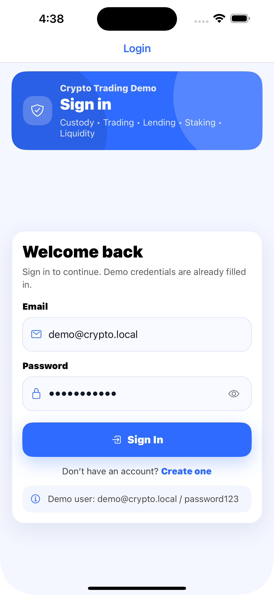<br/>
      <sub><b>Login</b></sub>
    </td>
    <td align="center">
      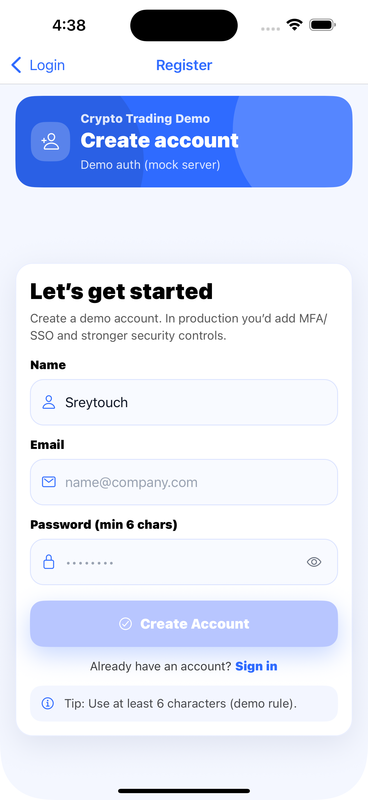<br/>
      <sub><b>Register</b></sub>
    </td>
    <td align="center">
      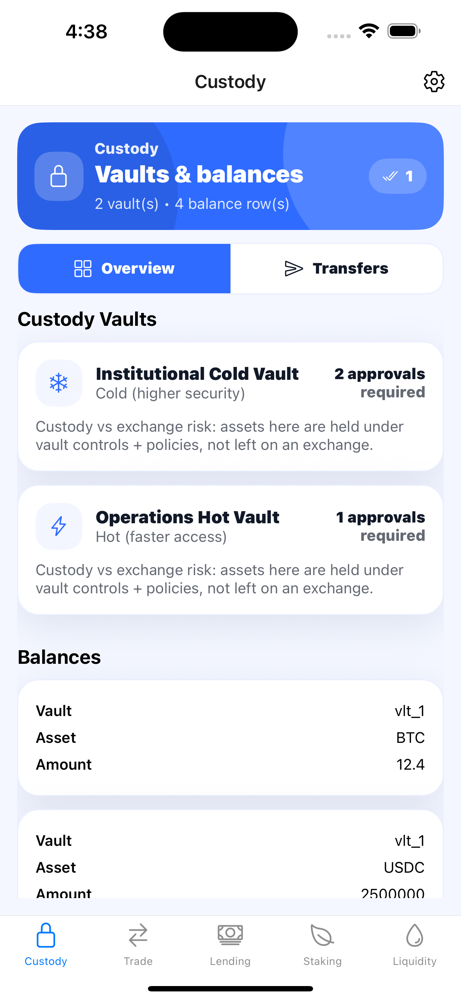<br/>
      <sub><b>Custody Overview</b></sub>
    </td>
  </tr>

  <tr>
    <td align="center">
      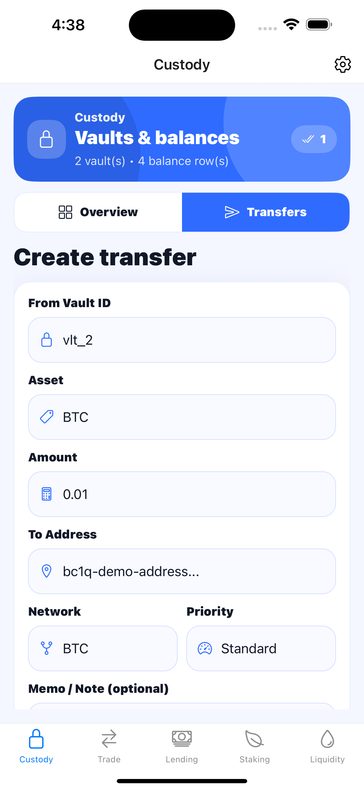<br/>
      <sub><b>Custody Transfers</b></sub>
    </td>
    <td align="center">
      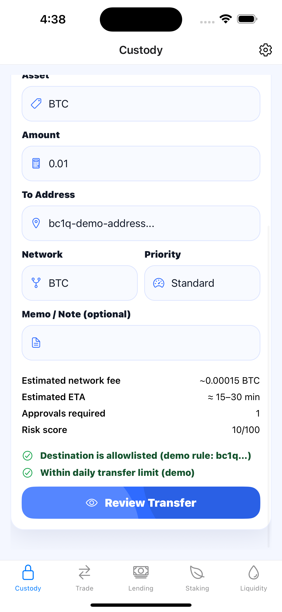<br/>
      <sub><b>Custody Transfers 2</b></sub>
    </td>
    <td align="center">
      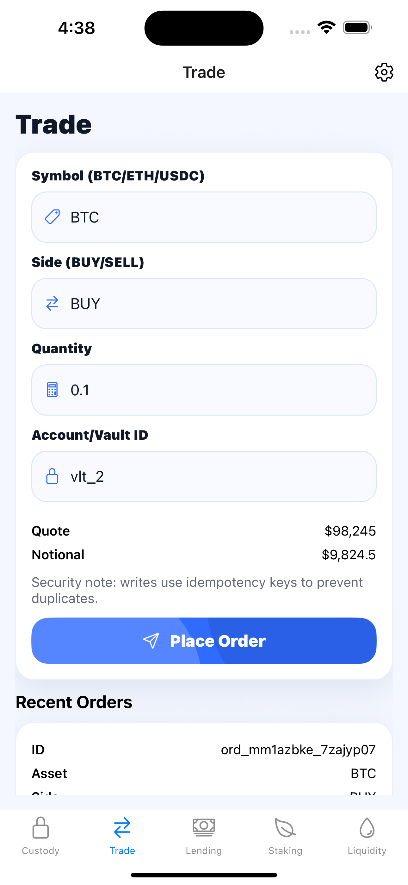<br/>
      <sub><b>Trend</b></sub>
    </td>
  </tr>

  <tr>
    <td align="center">
      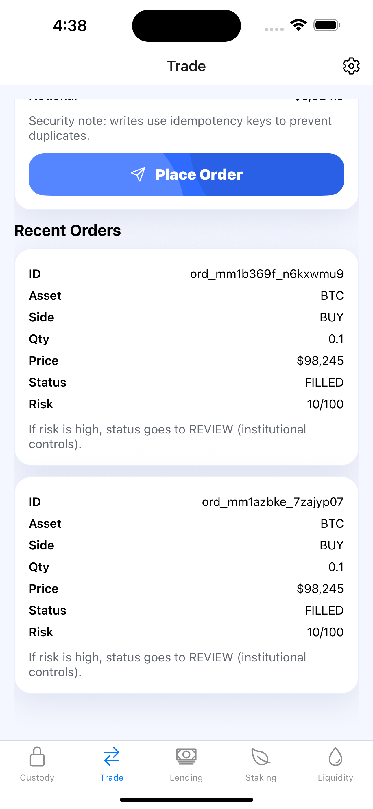<br/>
      <sub><b>Trend Detail</b></sub>
    </td>
    <td align="center">
      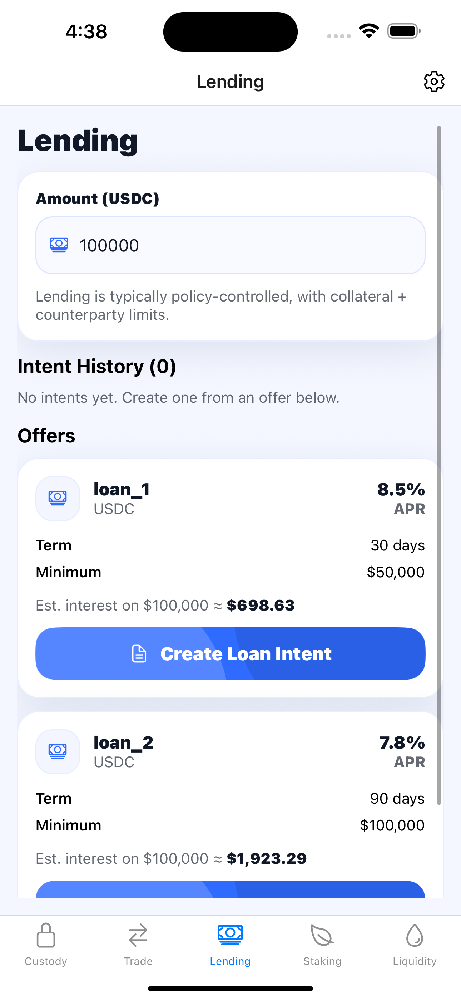<br/>
      <sub><b>Lending</b></sub>
    </td>
    <td align="center">
      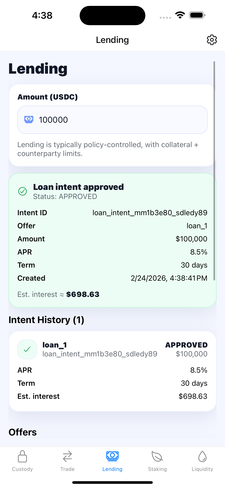<br/>
      <sub><b>Lending Detail</b></sub>
    </td>
  </tr>

  <tr>
    <td align="center">
      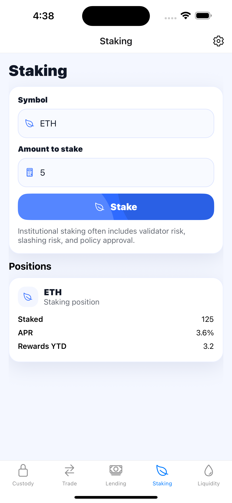<br/>
      <sub><b>Staking</b></sub>
    </td>
    <td align="center">
      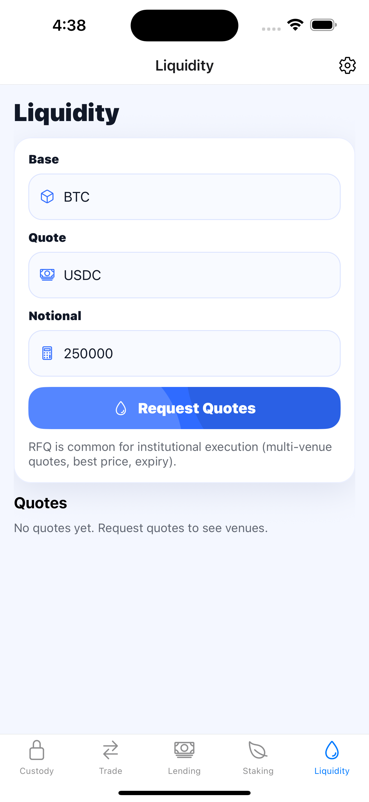<br/>
      <sub><b>Liquidity</b></sub>
    </td>
    <td align="center">
      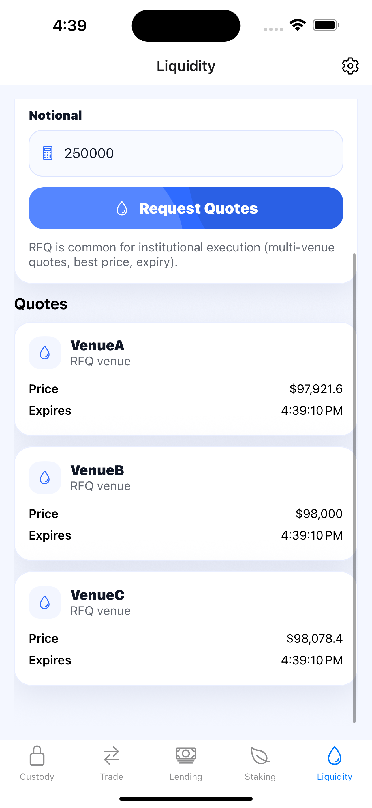<br/>
      <sub><b>Liquidity Detail</b></sub>
    </td>
  </tr>

  <tr>
    <td align="center">
      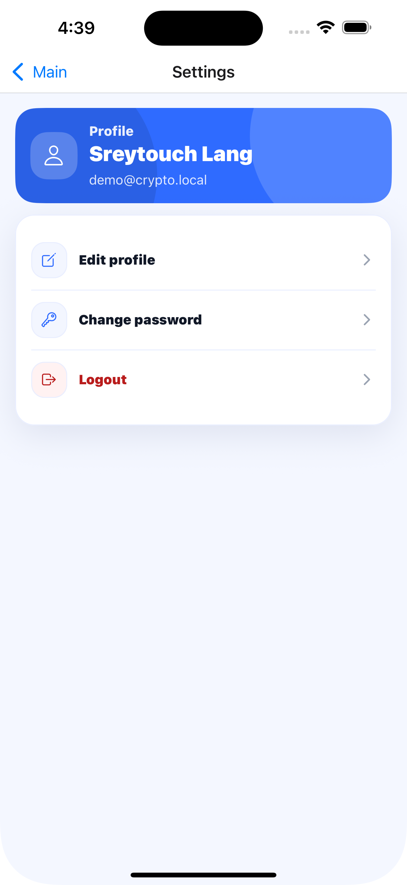<br/>
      <sub><b>Setting</b></sub>
    </td>
    <td align="center">
      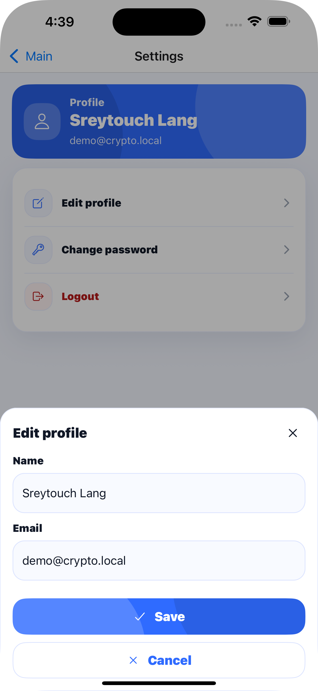<br/>
      <sub><b>Edit Profile</b></sub>
    </td>
    <td align="center">
      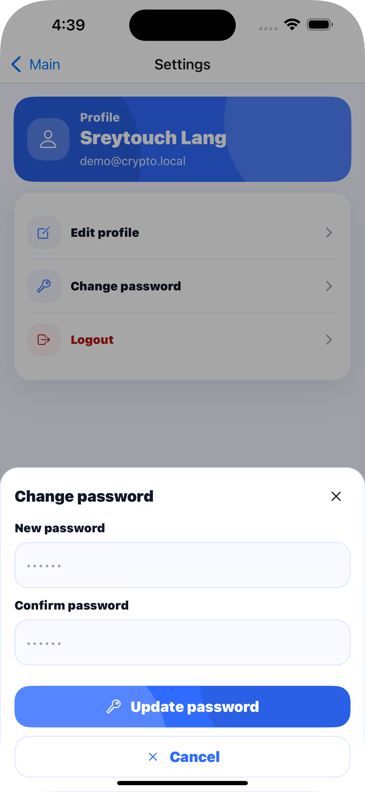<br/>
      <sub><b>Update Password</b></sub>
    </td>
  </tr>

  <tr>
    <td align="center">
      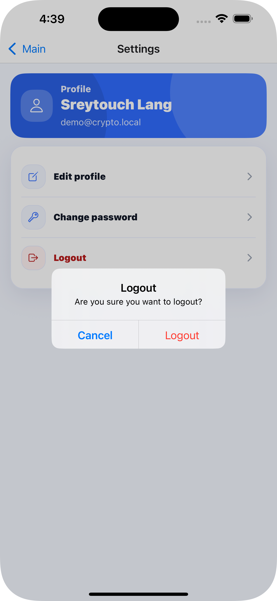<br/>
      <sub><b>Logout</b></sub>
    </td>
    <td></td>
    <td></td>
  </tr>
</table>

### Architecture & Flow Diagrams

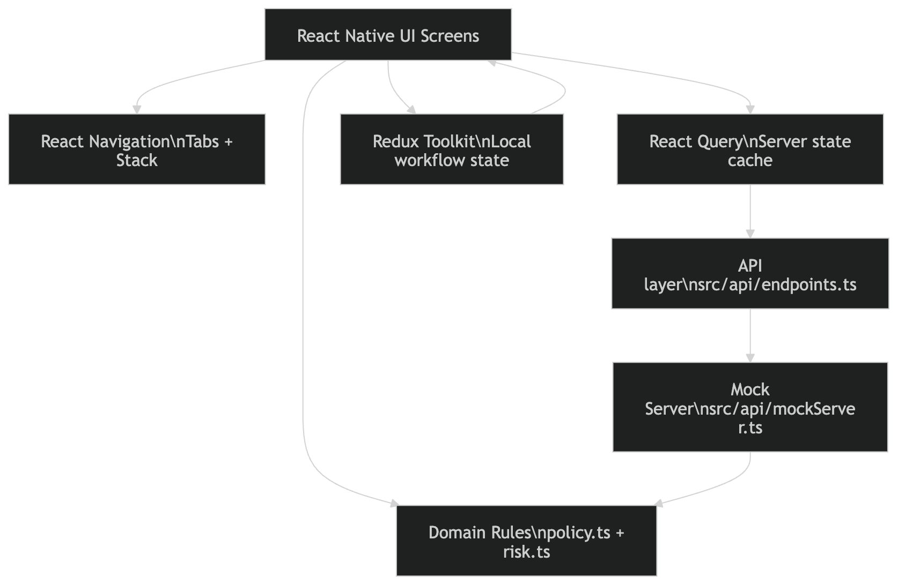
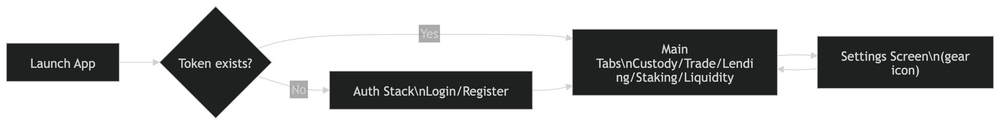

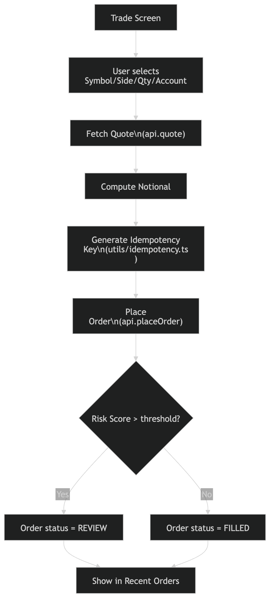
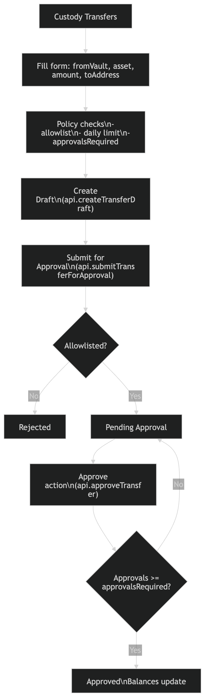
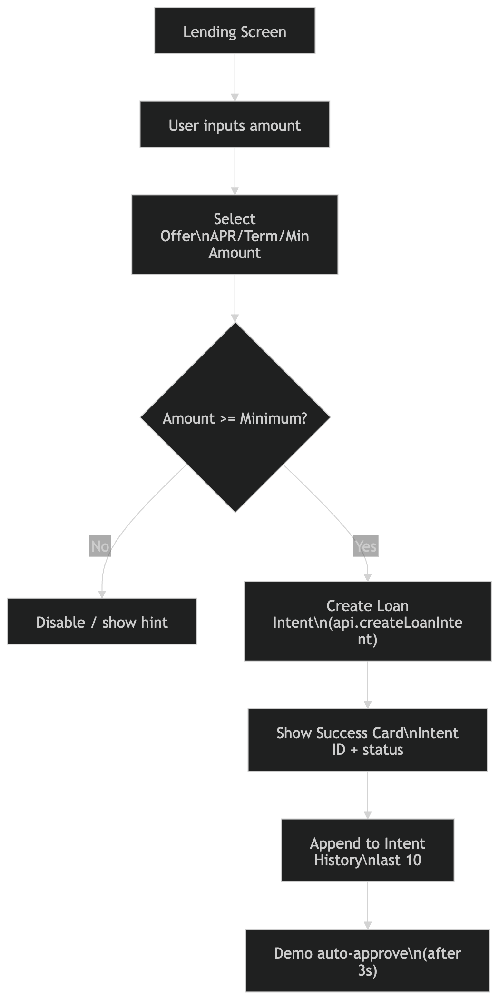
.png)

### Notes / Project View


## Troubleshooting

### “Property ‘crypto’ doesn’t exist” (Hermes)

Cause: packages like `nanoid` rely on `crypto.getRandomValues`.  
Fix used in this repo: Hermes-safe ID + idempotency generator using `Math.random + Date.now`.

---

## Future Enhancements

- Real approval queue shared across trade + custody
- Persist order/intent history using AsyncStorage
- Vault policy editor (limits, allowlists, approvers)
- Biometric lock UI option
  
